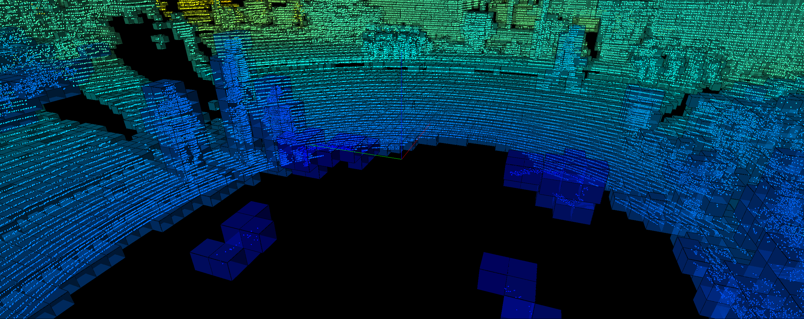

# CUDA Voxelization (PyTorch + VisPy)

Minimal playground for GPU voxelization of KITTI point clouds and quick 3D visualization.



## Prereqs
- Python 3.10+
- CUDA-capable GPU + CUDA drivers
- uv (or pip) to install deps

## Install
```bash
uv sync
```

Install a matching CUDA PyTorch before building the extension (torch is not in build-system deps):
```bash
pip install --extra-index-url https://download.pytorch.org/whl/cu124 torch torchvision torchaudio
```

Build the CUDA extension in-place (works with uv or plain python):
```bash
uv run setup.py build_ext --inplace
# or
python setup.py build_ext --inplace
```

## Visualize a folder of KITTI `.bin` files
```bash
uv run vis_simple.py /path/to/velodyne
```
Keys: Right/N/Space/Enter → next file, Left/B → previous. Close the window to quit.

## What it does
- Loads KITTI-format point clouds (x, y, z, intensity)
- Runs CUDA voxelization (`voxelization/ops.py` binding)
- Colors points/voxels by distance from the origin using a jet colormap
- Renders with VisPy turntable camera

## Note
The wheel/extension is built via the included CUDA source in `voxelization/csrc`. Use the provided `uv.lock`/`pyproject.toml` for reproducible builds.
